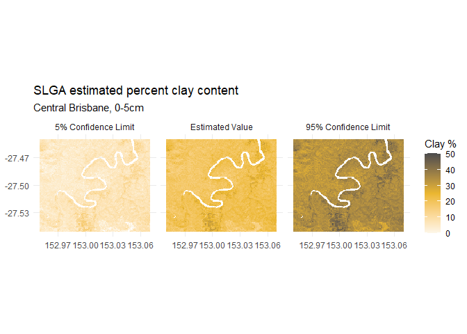

<!-- README.md is generated from README.Rmd. Please edit that file -->
[](https://travis-ci.com/obrl-soil/slga)

slga
====

slga offers the ability to download geosgraphic subsets of raster data from the Soil and Landscape Grid of Australia.

Installation
------------

Install from github with

``` r
devtools::install_github("obrl-soil/slga")
```

Example
-------

``` r
library(raster)
#> Loading required package: sp
library(slga)
```

``` r
# get surface clay content for King Island
aoi <- c(143.75, -40.17, 144.18, -39.57)
ki_surface_clay <- get_slga_data(product = 'TAS', attribute = 'CLY',
                                 component = 'all', depth = 1,
                                 aoi = aoi, write_out = FALSE)
```



See the package vignette for further detail.

------------------------------------------------------------------------
