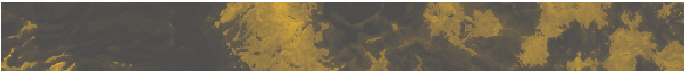

```{r setup, include = FALSE}
knitr::opts_chunk$set(
  collapse = TRUE,
  comment = "#>",
  fig.path = "man/figures/README-",
  out.width = "100%"
)
```

[](https://travis-ci.com/obrl-soil/slga)
[](https://codecov.io/github/obrl-soil/slga?branch=master)

[](https://obrl-soil.github.io/slga)

# slga

`slga` offers the ability to download geographic subsets of raster data from the [Soil and Landscape Grid of Australia](www.clw.csiro.au/aclep/soilandlandscapegrid/). The Grid was generated in 2014 from a compilation of Australian soil and landscape data and contains a set of modelled soil attributes that meet the [globalsoilmap.net](http://globalsoilmap.net/) specification. 

Also available for download are a set of terrain and climate covariates considered useful in soils modelling. These are primarily derived from [GeoScience Australia's](http://www.ga.gov.au/) [SRTM DEM products](http://www.ga.gov.au/scientific-topics/national-location-information/digital-elevation-data).

All products are returned in GDA94 long/lat (EPSG:4283) and have a cell resolution of 3" (roughly 90m). 

## Getting Started

Install from github with

```{r 'installation', eval = FALSE}
devtools::install_github("obrl-soil/slga")
```

then read the package vignette.

### Asking for help

If you get stuck using this package or the data it provides, please post a question on [Stack Overflow](https://stackoverflow.com/) (for internet connectivity problems) or the [GIS StackExchange](https://gis.stackexchange.com/) (for raster/geospatial issues). This means that others can benefit from the discussion, and more people are available to help you. You're welcome to ping me in a comment on those websites or on twitter (@obrl_soil) to get my attention.

***
