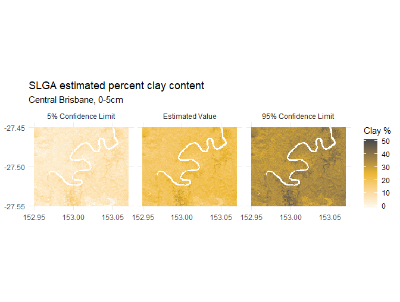

```{r setup, include = FALSE}
knitr::opts_chunk$set(
  collapse = TRUE,
  comment = "#>",
  fig.align = 'center', fig.width = 8, fig.height = 5, fig.caption = FALSE
)
```

This is a quick overview of how to retrieve data from the Soil and Landscape Grid of Australia.

```{r pkgs}
library(raster)
library(slga)
options(stringsAsFactors = FALSE)
```

Two high-level wrapper functions, `get_soils_data()` and `get_lscape_data()`, have been provided to manage downloads. To use them correctly, you should be aware of the package datasets `slga_attribute_info()` and `slga_product_info()`. They contain allowable values for some of the function inputs as well as key metadata.

The two tables are derived from information on the [SLGA website](http://www.clw.csiro.au/aclep/soilandlandscapegrid) and in the WCS metadata documents.

## Soils data

Soils data is available in a large number of combinations - each product has a set of available attributes (soil properties). Not all soil attributes are available within each product, but you can check which ones are available in `slga_attribute_info()`. Each soil attribute has six depth slices extending from the land surface to 2.0 metres below. Each soil attribute also has three associated values - the estimated value, plus its lower (5%) and upper (95%) confidence limits. Effectively, if you visited a single pixel on the Grid and sampled 100 points inside that pixel, you should expect that 90 of those samples would return values within those limits.

Detailed metadata for each product can be found on the [CSIRO Data Access Portal](https://data.csiro.au/dap)

The function `get_soils_data()` is capable of pulling out data for one combination of product, soil attribute, and depth. It gives the option of returning any combination of value and confidence interval layers, either as a `raster` or `rasterStack` object.

As a demonstration, the surface (0.0-0.05 metre) estimated percent clay content for central Brisbane is available with `data('bne_surface_clay')`:

```{r bnec}
data('bne_surface_clay')
bne_surface_clay
```

{width=95%}

Note that some open-water areas have 0 values rather than NA; these are difficult to remove safely without an adequate mask. You may need to generate one yourself, particularly if you are working along the coast.

The query to retrieve the above maps looked like:

```{r 'qry', eval = FALSE}
aoi <- c(152.95, -27.55, 153.07, -27.45)
bne_surface_clay <- get_soils_data(product = 'NAT', attribute = 'CLY',
                                   component = 'ALL', depth = 1,
                                   aoi = aoi, write_out = FALSE)

```

Note that valid `product` parameters are defined in `slga_product_info$Short_Name`, and valid `attribute` parameters in `slga_attribute_info$Code`. If a particular combination is not available, the function will fail gracefully.

## Landscape data

18 landscape datasets are available, describing DEM-derived terrain attributes and climatic influences. These are considered to be effective environmental covariates in soil modelling exercises. Detailed metadata for each product can be found on the [CSIRO Data Access Portal](https://data.csiro.au/dap).

`get_lscape_data()` only requires a product code and aoi, as each landscape attribute is a single raster surface. For example, the Multi-resolution Valley Bottom Flatness Index for central Brisbane is given by

```{r 'qry2', eval = FALSE}
bne_mrvbf <- get_lscape_data(product = 'MRVBF', aoi = aoi, write_out = FALSE)
```

## Area of interest

`slga` output datasets are always source-aligned - that is, the returned SLGA data will align with its parent coverage rather than your supplied `aoi` parameter. This is deliberate; WCS services default to target-alignment, which involves hidden server-side resampling behaviour when a geographical subset is supplied. This behaviour is essential for WCS' primary use case - accessing data dynamically in a GUI. For constructing reproducible workflows that start with rasters, however, it is not appropriate. If you need a dataset that aligns with other data, it is best practice to carry out any resampling and realignment at your end, after retrieving a 'clean' subset of SLGA data. This ensures that these operations are clearly documented. Functions like `raster::resample()` may be useful at this point.

## Saving data

If you want to save a copy of the downloaded raster(s) to your working directory, you will need to specify `write_out = TRUE`. 

## Advanced querying

To retrieve data from e.g. more than one depth, you can use an iterator like `base::lapply()` or `purrr::map()`. For instance, to retrieve estimated clay values for all depths over King Island, you could do the following:

```{r 'allclay', eval = FALSE}
# not run
bne_all_clay <- lapply(seq.int(6), function(d) {
  get_soils_data(product = 'NAT', attribute = 'CLY', component = 'VAL',
                 depth = d, aoi = aoi, write_out = FALSE)
})
bne_all_clay <- raster::brick(bne_all_clay)

```

Similar iteration can be carried out with a vector of attributes or products. Note that while all the soils products align with each other, not all of the landscape products do. Stacking the latter together will require some pre-processing.

## Point data

Data values for single-point locations within the grid can be retrieved using `get_soils_point()` or `get_lscape_point()`, as follows:

```{r 'pt0', eval = FALSE}
#not run
clay_pt  <- get_soils_point('NAT', 'CLY', 'VAL', 5, c(153, -27.5))
slope_pt <- get_lscape_point('SLPPC', c(153, -27.5))
```

A non-spatial dataframe of values is returned. Summaries of the area around a point can also be retrieved. The summary can be of a square or circular window around a point.

```{r 'ptb', eval = FALSE}
# get the average predicted clay content for 60-100cm within ~300m of a point
avg_clay <- get_soils_point('NAT', 'CLY', 'VAL', 5, c(153, -27.5),
                            buff = 3, buff_shp = 'circle', stat = 'mean')

```

Buffering is defined in terms of cells, not metres. A buffer of `n` cells implies that the raster extracted will be `2n + 1` cells wide and high, centered on the cell into which the supplied point of interest falls. 

Note that for datasets that have many points within a small area, it will be more efficient to download rasters covering the dataset bounding box before extracting point summaries using existing `raster` package functions.

## Metadata

Service and coverage level metadata for soil and landscape data can be retrieved with `metadata_soils()` and `metadata_lscape()`. For example, 

```{r mdeg, eval = FALSE}
nat_clay_mdc <- metadata_soils('NAT', 'CLY', req_type = 'desc')
```

***
